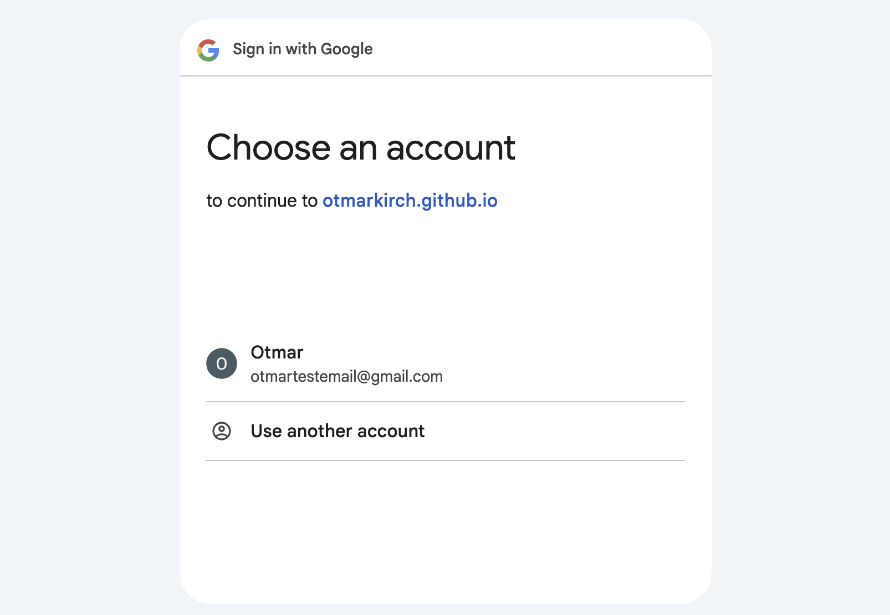
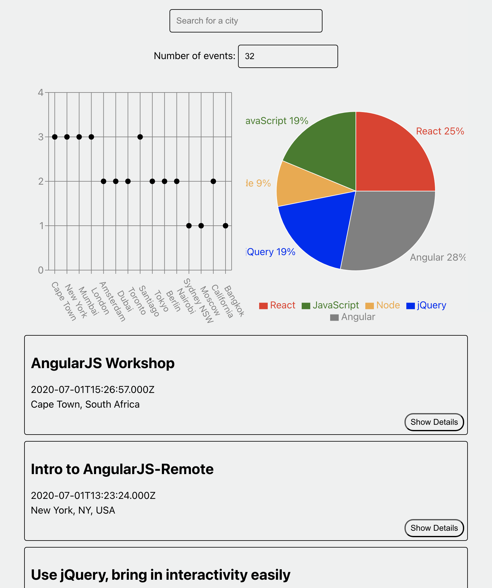
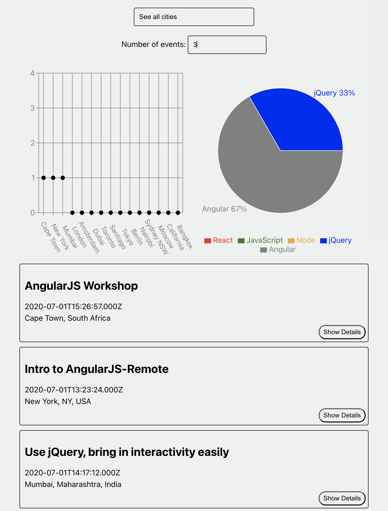
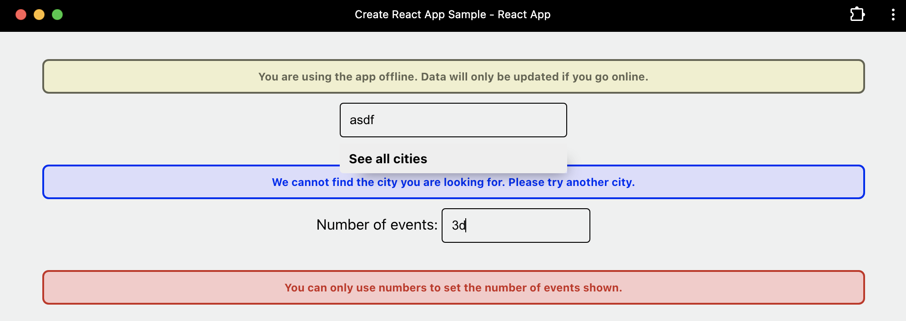
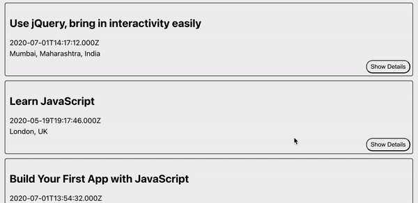

# meetApp

<!-- toc -->

- [Description](#description)
- [Technologies](#technologies)
- [Setup](#setup)
  * [Hosted with GitHub Pages](#hosted-with-github-pages)
- [Key Features](#key-features)
  * [User Stories](#user-stories)
  * [Scenarios](#scenarios)
- [Impressions](#impressions)
  * [Login](#login)
  * [Main View](#main-view)
  * [Filter Events by City](#filter-events-by-city)
  * [Choose Number of Events](#choose-number-of-events)
  * [Display Warnings](#display-warnings)
  * [Show/Hide Event Details](#showhide-event-details)
- [Conclusion](#conclusion)
  * [Challenges](#challenges)
  * [Future Improvements](#future-improvements)
  * [Final Thoughts](#final-thoughts)

<!-- tocstop -->

## Description
This project involves building a serverless, progressive web application (PWA) using React and a test-driven development (TDD) approach. The application leverages the Google Calendar API to fetch upcoming events. By combining serverless and PWA concepts, the application benefits from no backend maintenance, scalability, availability, no idle time costs, instant loading, offline support, push notifications, "add to home screen" prompt, responsive design, and cross-platform compatibility. The TDD approach ensures high-quality code by writing tests before actual functionality. The application also includes data visualization through graphs, enhancing its visual appeal and data interpretation. Users can search for a city and get a list of events hosted in that city. The data visualization component includes a scatter plot showing the number of events in each location and a pie chart visualizing the popularity of event genres.

## Technologies
- React
- Google Calendar API
- Google OAuth
- AWS Lambda
- AWS API Gateway
- Progressive Web App (PWA) with offline support
- Serverless
- Jest and Puppeter for Test-Driven Development (TDD)
- Cucumber for Behavior-Driven Development (BDD)

## Setup

### Hosted with GitHub Pages
The app is hosted with GitHub Pages and can be viewed [here](https://otmarkirch.github.io/meetApp/). For accessing the Google calender which provides the data for the app, the user needs to sign in with their Google account.

As a progressive web app (PWA), the app can be installed on the user's device by clicking on the "Add to Home Screen" button in the browser.

## Key Features
This projects purpose was to build a serverless, progressive web application (PWA) using React and a test-driven development (TDD) approach as well as a behavior-driven development approach(BDD). Features therefore were broken down into user stories and scenarios. These were then implemented using the TDD approach with Jest ([unit and integration tests](https://github.com/OtmarKirch/meetApp/tree/main/src/__tests__)) and Puppeteer ([end to end tests](https://github.com/OtmarKirch/meetApp/blob/main/src/__tests__/EndToEnd.test.js)). The BDD approach was implemented using Cucumber ([Gherkin and test files](https://github.com/OtmarKirch/meetApp/tree/main/src/features)).

### User Stories

1. FilterEventsbyCity: As a user, I should be able to filter events by city so that I can see a list of events taking place in that city.

2. Show/HideEventDetails: As a user, I should be able toggle the view of event details so that I make the event details visible or not visible

3. SpecifyNumberofEvents: As a user, I should be able to specify a number of events, so that I am displayed only a list that holds a maximum number of events.

4. UsetheAppWhenOffline: As a user, I should be able to use an offline mode, so that the functionality of the app remains even when offline

5. AddanAppShortcuttotheHomeScreen: As a user, I should be able to click on a Home Button, so that I get to the home screen from anywhere in the app

6. DisplayChartsVisualizingEventDetails: As a user, I should have an option for visualization available, so that I am shown a visualization of the event details.

### Scenarios
<!-- toc-exclude -->
#### Feature 1: Filter Events By City
##### Scenario 1: When user hasn’t searched for a city, show upcoming events from all cities.
- Given user hasn’t searched for any city;
- When the user opens the app;
- Then the user should see a list of upcoming events.
##### Scenario 2: User should see a list of suggestions when they search for a city.
- Given the main page is open;
- When user starts typing in the city textbox;
- Then the user should receive a list of cities (suggestions) that match what they’ve typed.
##### Scenario 3: User can select a city from the suggested list.
- Given user was typing “Berlin” in the city textbox AND the list of suggested cities is showing;
- When the user selects a city (e.g., “Berlin, Germany”) from the list;
- Then their city should be changed to that city (i.e., “Berlin, Germany”) AND the user should receive a list of upcoming events in that city.
  
#### Feature 2: Show/Hide Event Details
##### Scenario 1: An event element is collapsed by default.
- Given a list of events is displayed
- the user has not toggled event details
- event details of all events should be collapsed
##### Scenario 2: User can expand an event to see details.
- Given a list of events was displayed
- When the user clicked on an event
- Then the selected event should be expanded with its details
##### Scenario 3: User can collapse an event to hide details.
- Given a list of events is displayed with at least one event expanded
- When the user clicked on an expanded event
- Then the view of the selected event should collapse

#### Feature 3: Specify Number of Events
##### Scenario 1: When user hasn’t specified a number, 32 events are shown by default.
- A list of events is displayed
- When the user did not specify how many to display
- Then 32 events should be displayed
##### Scenario 2: User can change the number of events displayed.
- A list of events is displayed
- When the user specified a number of events to display
- Then as many events as the specified number should be displayed
#### Feature 4: Use the App When Offline
##### Scenario 1: Show cached data when there’s no internet connection.
- The internet connection was severed
- When the user openes the app
- Then the events should be listed as usual with data from the cache
##### Scenario 2: Show error when user changes search settings (city, number of events).
- The internet connection was severed
- when the user changes the search setting
- Then an error should be displayed that an internet connection is required to change the search

#### Feature 5: Add an App Shortcut to the Home Screen
##### Scenario 1: User can install the meet app as a shortcut on their device home screen.
- The user decided to install a shortcut for the meet app
- When the user clicked on "Create home shortcut"
- Then the shortcut should appear on the home screen

#### Feature 6: Display Charts Visualizing Event Details
##### Scenario 1: Show a chart with the number of upcoming events in each city.
- The details of an event where displayed
- When the user clicked on a "Visualize event details"
- Then the event details should appear visualized

<!-- toc-exclude -->

## Impressions

### Login
When the user opens the app, a Google login screen is displayed. The user can log in with their Google account to access the app.

### Main View
After logging in, the user is presented with the main view of the app. The user can search for events in a specific city, view a list of events. The event data is obtained from the Google Calendar API and visualized in a scatter plot and a pie chart.

### Filter Events by City

The user can filter events by city. When the user starts typing in the city textbox, a list of cities (suggestions) that match what they’ve typed is displayed. The user can select a city from the suggested list. After selecting a city, the user receives a list of upcoming events in that city.

### Choose Number of Events

The user can specify the number of events they want to see. The default number of events is 32. This number of events can be displayed by entering a number in the "Number of Events" input field. The stats are updated accordingly.

### Display Warnings
As a PWA, the app can be used offline. When the user is offline, there is a warning that data is only updated when the user is online. Also, when the user changes the search settings, a warning appears when there is no such city as the search string suggests the characters for the number of evnts are not numbers.

### Show/Hide Event Details

The user can expand an event to see its details by clicking on "Show Details". Clicking on "Hide Details" collapses the event details.

## Conclusion
### Challenges
#### Serverless functions
Implementing the serverless AWS lambda functions was the greatest challenge in this project. Configuring the AWS account, setting up the AWS CLI, and creating the lambda functions were all new concepts to me. The serverless functions are used to implement the functionality of the app, including user access by obtaining and refreshing OAuth2 tokens. Yet, it was certainly worth theThe use of serverless functions allows the app to scale dynamically with growing user demand.

#### Test Driven Development
The TDD approach was also a challenge at first. Figuring out how to write tests before the actual functionality was a new concept to me. However, the TDD approach ensures high-quality code by writing tests before actual functionality. This approach also helps to identify potential issues early in the development process. When I got the hang of it, I found it to be a very useful approach to writing code. I started writing some tests which were actually not strictly required by the project, but I found it to be a good practice to write tests for all the components I was building. This way I could ensure that the components were working as expected and that I could easily identify any issues that might arise.

### Future Improvements
As a next step I would like to implement the possibility to select specific events on a personal list. These can then be represented in the scatter plot and pie chart. This way, the user can get an overview of the events they are interested in, including a visualization of the event genres and the number of events in each location.

### Final Thoughts
This project has been a crucial step for me as a developer. Serverless functions, progessive web apps, and test-driven development were all new concepts to me. Yet, they are very important. Especially the test-driven development approach has been very appealing to me. I found it to be a very useful approach to minimize the number of bugs from the very beginning. Although this has the potential to be very time cosuming, I think it is worth it in the long run. Having a tool that allows quick testing of new code, whether the new code breaks the existing code, is very satisfying. I am looking forward to using this approach in future projects.

